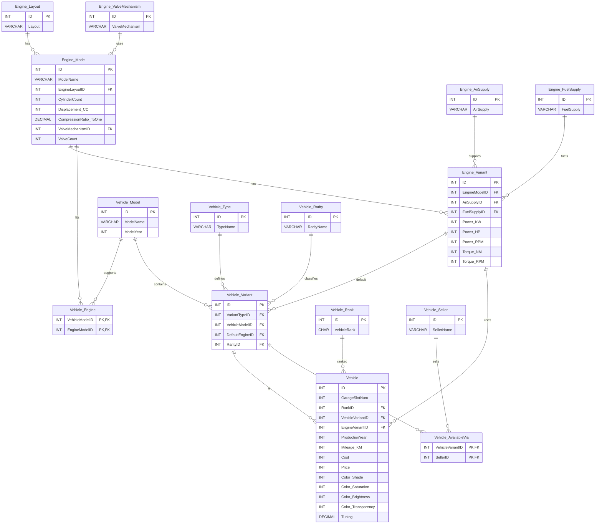

# SQL Practice

This is to learn, practice, and revice on SQL, while also use to store game data of Retro Garage.
The SQL used in this project is MySQL.

## ERD

```mermaid
erDiagram

    Engine_Layout ||--o{ Engine_Model : has
    Engine_ValveMechanism ||--o{ Engine_Model : uses
    Engine_AirSupply ||--o{ Engine_Variant : supplies
    Engine_FuelSupply ||--o{ Engine_Variant : fuels
    Engine_Model ||--o{ Engine_Variant : has
    Engine_Model ||--o{ Vehicle_Engine : fits
    Vehicle_Model ||--o{ Vehicle_Engine : supports
    Engine_Variant ||--o{ Vehicle_Variant : default
    Engine_Variant ||--o{ Vehicle : uses
    Vehicle_Type ||--o{ Vehicle_Variant : defines
    Vehicle_Rarity ||--o{ Vehicle_Variant : classifies
    Vehicle_Model ||--o{ Vehicle_Variant : contains
    Vehicle_Variant ||--o{ Vehicle : is
    Vehicle_Rank ||--o{ Vehicle : ranked
    Vehicle_Variant ||--o{ Vehicle_AvailableVia : available_via
    Vehicle_Seller ||--o{ Vehicle_AvailableVia : sells

    Engine_Layout {
        INT ID PK
        VARCHAR Layout
    }

    Engine_ValveMechanism {
        INT ID PK
        VARCHAR ValveMechanism
    }

    Engine_AirSupply {
        INT ID PK
        VARCHAR AirSupply
    }

    Engine_FuelSupply {
        INT ID PK
        VARCHAR FuelSupply
    }

    Engine_Model {
        INT ID PK
        VARCHAR ModelName
        INT EngineLayoutID FK
        INT CylinderCount
        INT Displacement_CC
        DECIMAL CompressionRatio_ToOne
        INT ValveMechanismID FK
        INT ValveCount
    }

    Engine_Variant {
        INT ID PK
        INT EngineModelID FK
        INT AirSupplyID FK
        INT FuelSupplyID FK
        INT Power_KW
        INT Power_HP
        INT Power_RPM
        INT Torque_NM
        INT Torque_RPM
    }

    Vehicle_Rarity {
        INT ID PK
        VARCHAR RarityName
    }

    Vehicle_Type {
        INT ID PK
        VARCHAR TypeName
    }

    Vehicle_Model {
        INT ID PK
        VARCHAR ModelName
        INT ModelYear
    }

    Vehicle_Variant {
        INT ID PK
        INT VariantTypeID FK
        INT VehicleModelID FK
        INT DefaultEngineID FK
        INT RarityID FK
    }

    Vehicle_Seller {
        INT ID PK
        VARCHAR SellerName
    }

    Vehicle_AvailableVia {
        INT VehicleVariantID PK, FK
        INT SellerID PK, FK
    }

    Vehicle_Engine {
        INT VehicleModelID PK, FK
        INT EngineModelID PK, FK
    }

    Vehicle_Rank {
        INT ID PK
        CHAR VehicleRank
    }

    Vehicle {
        INT ID PK
        INT GarageSlotNum
        INT RankID FK
        INT VehicleVariantID FK
        INT EngineVariantID FK
        INT ProductionYear
        INT Mileage_KM
        INT Cost
        INT Price
        INT Color_Shade
        INT Color_Saturation
        INT Color_Brightness
        INT Color_Transparency
        DECIMAL Tuning
    }
```